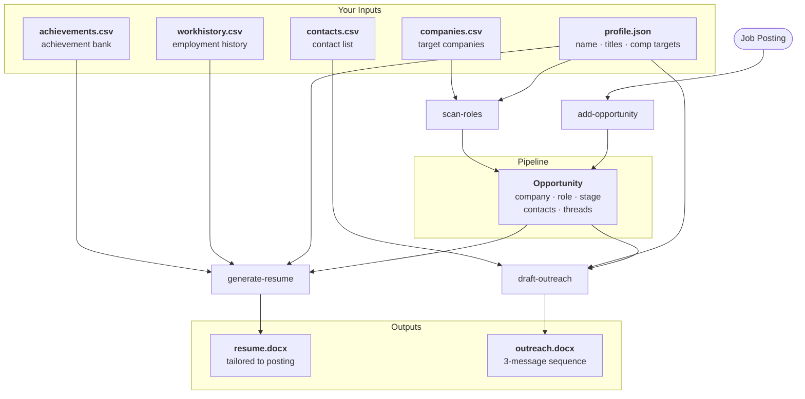

# JobCrawler

An executive job search orchestration system for Director through C-suite candidates. JobCrawler is built for high-stakes, relationship-driven searches where the difference between landing the role and being overlooked is preparation, timing, and network activation — not just applying.

## Vision

Most job search tools are passive trackers. JobCrawler is an execution system.

At the executive level, roles are rarely won through job boards. They're won through relationships, narrative precision, and coordinated outreach across multiple stakeholders. The process is slow, non-linear, and high-context — and most candidates manage it in a fragmented patchwork of spreadsheets, email drafts, and calendar reminders.

JobCrawler changes the workflow:

- **Company-first, not posting-first** — Build a target list and monitor for role emergence rather than reacting to what's posted
- **Evidence-based narrative** — Your resume and outreach are grounded in metrics and decisions, not adjectives
- **Multi-threaded outreach** — Every opportunity has a stakeholder map and a threading plan, not a single "apply and hope"
- **Artifact generation** — Tailored resumes, outreach sequences, and interview prep are generated from your achievement bank, not rewritten from scratch each time
- **Pipeline clarity** — One view of where every opportunity stands and what the next action is

The goal is to compress the search timeline and improve conversion by making the hard parts systematic — not easier, but consistent.

## How It Works



JobCrawler is a set of Claude Code commands that operate on two locations:

1. **This repo** (`jobcrawler/`) — the command definitions, scripts, and configuration templates
2. **Your personal work folder** (`PERSONAL_WORKDIR`) — where all your data and generated artifacts live

### Why a separate personal folder?

Your resume artifacts, job postings, contact notes, and generated documents are personal data. Keeping them outside the repo means:

- **Sync without friction** — Point `PERSONAL_WORKDIR` to a cloud-synced folder (OneDrive, Dropbox, iCloud Drive) and your artifacts are automatically backed up and accessible across devices
- **Clean separation** — The repo stays generic and shareable; your data stays private
- **No accidental commits** — Your work history, compensation targets, and contact lists never touch version control

A typical setup looks like:

```
~/code/jobcrawler/          # This repo — commands and scripts
~/OneDrive/job-search/      # PERSONAL_WORKDIR — your data and artifacts
  inputs/
    profile.json            # Your background, target titles, comp targets
    workhistory.csv         # Employment history
    achievements.csv        # Achievement bank with metrics and themes
    contacts.csv            # Contact list with relationship context
    companies.csv           # Target company list
  opportunities/
    stripe_vp_strategy/     # One folder per opportunity
      opportunity.json
      resume_2026-05-01.docx
      outreach_alex_chen.docx
  index.json                # Pipeline index across all opportunities
```

## Setup

### Prerequisites

- [Claude Code](https://claude.ai/code) — required to run the commands
- Python 3.8+ — required for document generation
- `python-docx` — install with `pip install python-docx`

### Installation

1. **Clone the repo:**
   ```bash
   git clone https://github.com/yourusername/jobcrawler.git
   cd jobcrawler
   ```

2. **Set up Python dependencies:**
   ```bash
   python3 -m venv .venv
   source .venv/bin/activate
   pip install python-docx
   ```

3. **Create your personal work folder:**
   ```bash
   mkdir -p ~/job-search/inputs
   ```
   Or point it at a cloud-synced location:
   ```bash
   mkdir -p ~/OneDrive/job-search/inputs
   ```

4. **Configure Claude Code settings:**

   Copy the settings template:
   ```bash
   cp .claude/settings.local.json.template .claude/settings.local.json
   ```

   Edit `.claude/settings.local.json` and set your paths:
   ```json
   {
     "env": {
       "PERSONAL_WORKDIR": "/path/to/your/job-search/folder",
       "JOBCRAWLER_DIR": "/path/to/jobcrawler"
     }
   }
   ```

   `PERSONAL_WORKDIR` should point to wherever you want artifacts saved — ideally a cloud-synced folder. `JOBCRAWLER_DIR` should point to where you cloned this repo.

5. **Populate your inputs:**

   JobCrawler reads from a set of CSV and JSON files in `$PERSONAL_WORKDIR/inputs/`. The `sample/inputs/` folder in this repo contains fully worked example files you can use as a starting point — copy them to your work folder and replace the fictional data with your own:

   ```bash
   cp -r sample/inputs/* /path/to/your/job-search/inputs/
   ```

   See [Input File Reference](#input-file-reference) below for a full description of each file and its fields.

   At minimum, you need:
   - `profile.json` — your name, contact info, title targets, and compensation range
   - `workhistory.csv` — your employment history
   - `achievements.csv` — your achievement bank (the core of everything)

---

## Getting Your Data In

The input files are the foundation of everything JobCrawler generates. The most important — and most time-consuming — is `achievements.csv`. Here are two ways to populate it:

### Starting from scratch

Use the sample files in `sample/inputs/` as a template. Copy them to your work folder and replace the fictional data with your own, role by role.

### Starting from existing resumes

If you have past resumes, cover letters, LinkedIn exports, or performance reviews, you can instruct Claude to extract and structure your data automatically. Paste your documents into Claude Code and say something like:

> "Here are my past resumes. Please extract my work history, achievements, and key themes and populate my input files in `$PERSONAL_WORKDIR/inputs/`."

Claude will parse your existing materials and create or populate:
- `workhistory.csv` — from your employment history
- `achievements.csv` — from your bullet points, with themes inferred from the content
- `profile.json` — from your contact info and stated objectives

You'll want to review and clean up the output — particularly `themes` in `achievements.csv` and `confidence` ratings — but it gives you a solid starting point in minutes rather than hours.

---

## Commands

Commands are invoked from within Claude Code by typing `/command-name`. Each command reads your input files, generates the appropriate artifact, and writes output to your `PERSONAL_WORKDIR`.

### Typical flow

**1. You come across a role.**
Paste the URL into Claude Code and run:
```
/add-opportunity https://jobs.lever.co/stripe/vp-product
```
JobCrawler fetches the posting, extracts the company, title, and key requirements, and adds it to your pipeline. If the URL is behind a login wall (LinkedIn, etc.), paste the job description text directly instead.

**2. You want to find more roles proactively.**
Run `/scan-roles` to search job boards and your target companies' career pages. JobCrawler scores each result against your profile and shows them ranked A–D. Pick the ones worth pursuing — they get added to your pipeline automatically.

**3. You decide to pursue a role seriously.**
Run `/generate-resume` with the opportunity slug. JobCrawler selects the achievements from your bank that best match the posting, tailors the language to the role, and generates a `.docx` resume saved to that opportunity's folder.

**4. You identify a stakeholder to reach out to.**
Add them to `contacts.csv`, then run `/draft-outreach` with the opportunity slug. JobCrawler generates three standalone messages — initial outreach, a follow-up at one week, and a graceful close at two weeks — calibrated to your relationship type with that contact.

**5. Something moves.**
A contact responds, you get a screening call, you move to interviews. Run `/update-opportunity` to log the stage change and add notes. Your pipeline index stays current.

---

### `/add-opportunity`

Adds a new job opportunity to your pipeline from a URL or pasted text.

```
/add-opportunity [url]
```

**What it does:**
1. Fetches the job posting (or accepts pasted text if the URL is behind a login)
2. Extracts the company, role title, and key requirements
3. Creates an opportunity folder under `$PERSONAL_WORKDIR/opportunities/[slug]/`
4. Adds the opportunity to your pipeline index

**When to use it:** Any time you want to track a role — whether you found it on a job board, a career page, or heard about it through a contact.

---

### `/scan-roles`

Scans job boards and company career pages for roles matching your target profile. Scores, deduplicates, and adds matches to your pipeline.

```
/scan-roles [--titles "VP Strategy,Director Ops"] [--min-comp 250000] [--companies all|tier1|<name>]
```

**What it does:**
1. Reads your target titles and company list from your input files
2. Searches LinkedIn, Indeed, Glassdoor, Lever, and Greenhouse
3. Scores each result on title fit, seniority alignment, theme overlap, and company fit
4. Shows results ranked A–D and asks which to add
5. Logs the scan to prevent re-scanning too frequently

**When to use it:** Periodically (weekly or when you want to expand your pipeline) to surface new roles at your target companies without manually checking each career page.

---

### `/generate-resume`

Generates a tailored executive resume for a specific opportunity.

```
/generate-resume [slug]
```

**What it does:**
1. Reads the opportunity's key requirements
2. Selects achievements from your bank that match the role's themes
3. Rewrites subheadings and emphasis to align with the posting's language
4. Checks for gaps (key requirements with no matching evidence) and flags them
5. Generates a formatted `.docx` resume saved to the opportunity folder

**When to use it:** Once you've decided to pursue an opportunity seriously. Run it when you have a specific posting to tailor against — not as a general resume refresh.

---

### `/draft-outreach`

Generates a 3-message outreach sequence for a contact at a target company.

```
/draft-outreach [slug]
```

**What it does:**
1. Reads the opportunity and contact context
2. Generates three standalone messages: initial outreach, follow-up 1 (~1 week), follow-up 2 (~2 weeks)
3. Each message is self-contained — no "following up on my previous note"
4. Tone is calibrated for executive-level communication (formal, value-first, low-friction ask)
5. Saves a `.docx` archive copy to the opportunity folder

**When to use it:** Before reaching out to any stakeholder at a target company. Works for cold outreach, warm introductions, and alumni connections — the tone adapts to the relationship type.

---

### `/update-opportunity`

Updates an opportunity's stage, notes, or contacts.

```
/update-opportunity [slug]
```

**What it does:**
Updates the stage (`targeting` → `applied` → `screening` → `interviewing` → `offer` → `closed`), appends notes, or adds a contact to the opportunity record.

**When to use it:** After any meaningful interaction — a response to outreach, a screening call, moving to interviews, receiving an offer.

---

## Input File Reference

All input files live in `$PERSONAL_WORKDIR/inputs/`. Fully worked examples for all files are in `sample/inputs/`.

---

### `profile.json`

Your core profile, used by every command. Contains your contact information, the role titles you're targeting, your compensation range, and a pool of core strengths that the resume generator draws from.

```json
{
  "name": "Alex Rivera",
  "email": "alex.rivera@example.com",
  "phone": "+1 415 555 0192",
  "linkedin_url": "https://linkedin.com/in/alexrivera",
  "title_targets": [
    "VP Product",
    "Head of Product",
    "Director of Product"
  ],
  "compensation_targets": {
    "min": 250000,
    "target": 300000,
    "max": 400000,
    "currency": "USD"
  },
  "core_strengths": [
    "Product-led growth",
    "0-to-1 product development",
    "Cross-functional leadership"
  ]
}
```

| Field | Description |
|---|---|
| `title_targets` | The role titles `/scan-roles` searches for and `/generate-resume` optimizes toward. Be specific — these drive search queries and scoring. |
| `compensation_targets.min` | Hard floor used by `/scan-roles` to filter out roles where the stated max is below this threshold. Roles with no salary listed are kept. |
| `core_strengths` | Used as a reference pool when generating the Core Strengths section of a resume. The command synthesizes from your achievements — these aren't copied verbatim. |

---

### `workhistory.csv`

One row per role, most recent first. Provides the structure for the Professional Experience section of generated resumes.

| Column | Description |
|---|---|
| `job_id` | Unique identifier (e.g., `J001`). Used to link achievements to roles. |
| `company` | Company name as it should appear on the resume. |
| `title` | Your title at that company. |
| `location` | City and state (e.g., `San Francisco CA`). |
| `start_date` | Format: `YYYY-MM` (e.g., `2021-03`). |
| `end_date` | Format: `YYYY-MM`, or `present` for your current role. |
| `scope` | One-line description of your remit — team size, P&L, product lines. Rendered in italics under your title. Optional but recommended. |
| `is_early_career` | `true` or `false`. Early career roles are collapsed to 1–2 bullets in a condensed section at the bottom of the resume. |

---

### `achievements.csv`

The core of the system. Every resume, and every outreach message, draws from this bank. Invest time here — the quality of your outputs is directly proportional to the quality of your achievements.

One row per achievement. A single role typically has 6–15 achievements; you don't use all of them in any one resume — the command selects based on relevance to the specific posting.

| Column | Description |
|---|---|
| `id` | Unique identifier (e.g., `A001`). |
| `job_id` | Links to a role in `workhistory.csv`. |
| `Co` | Company name (redundant with job_id but useful for quick scanning). |
| `subheading` | Thematic grouping (e.g., `Revenue Growth`, `Organizational Leadership`). Used to structure resume sections. Max 3 subheadings per role on the generated resume. |
| `title` | Short label for the achievement (e.g., `Drove ARR expansion from $80M to $120M`). Not shown on the resume — used for internal reference. |
| `narrative` | The full achievement bullet as it will appear on the resume. Write in past tense, lead with impact, include metrics. This is copied (and optionally lightly rewritten) directly into the output. |
| `themes` | Semicolon-separated tags (e.g., `revenue growth;GTM strategy;team leadership`). This is how the resume command matches achievements to a job posting's requirements — tag thoroughly. |
| `confidence` | `high`, `medium`, or `low`. Reflects how strongly you can speak to this achievement in an interview. High-confidence achievements are preferred when multiple options match. |

**Tips for `themes`:** Use consistent terminology. If you tag some achievements `revenue growth` and others `ARR growth`, they won't be treated as equivalent. Keep a short list of your standard themes and apply them consistently.

**Tips for `narrative`:** Write the bullet exactly as you'd want it to appear. The command may lightly reword emphasis for a specific role, but the core evidence — numbers, scope, outcomes — should already be in the narrative.

---

### `contacts.csv`

One row per contact. Used by `/draft-outreach` to tailor message tone and `/scan-roles` to note warm paths into target companies.

| Column | Description |
|---|---|
| `id` | Unique identifier (e.g., `C001`). |
| `name` | Full name. |
| `company` | Their current company. Should match a company name in `companies.csv` if they're at a target company. |
| `title` | Their current title. |
| `relationship` | Free-text description of how you know them (e.g., `Former colleague at Meridian Technologies`). Used for context in outreach generation. |
| `relationship_type` | One of: `cold`, `mutual`, `alumni`, `prior_colleague`. Controls outreach tone — warm relationships get a different opening than cold ones. |
| `notes` | Any additional context — last interaction, what they mentioned, whether an intro has been offered. |

**`relationship_type` values:**
- `cold` — No prior connection. Outreach opens with a value-first hook.
- `mutual` — Connected through a shared contact. Reference the mutual connection.
- `alumni` — Shared school or previous employer. Leverage the common ground.
- `prior_colleague` — Worked together directly. Outreach is more personal and direct.

---

### `companies.csv`

Your target company list. Used by `/scan-roles` to scope searches and prioritize results, and by `/draft-outreach` to provide company context.

| Column | Description |
|---|---|
| `company` | Company name. Should be consistent with how you reference it in `contacts.csv`. |
| `tier` | `1` (highest priority) through `3`. Tier 1 and 2 companies are included in default scans. |
| `priority_score` | 1–10. Used alongside tier for finer-grained prioritization. Score 7+ companies are included in `tier1` scans even if their tier is 2. |
| `careers_url` | Direct URL to their careers or jobs page. Used by `/scan-roles` for targeted searches. |
| `comp_override` | Optional. Sets a per-company compensation floor that overrides the global `profile.json` minimum. Useful for high-cost-of-living companies or roles where you'd accept less. |
| `ats_platform` | The applicant tracking system they use (e.g., `greenhouse`, `lever`, `ashby`). Helps `/scan-roles` find and fetch postings from public ATS job boards. |
| `notes` | Free-text notes — context on why you're targeting them, known openings, recent news, etc. |

---

## License

See LICENSE for details.

See LICENSE for details.
